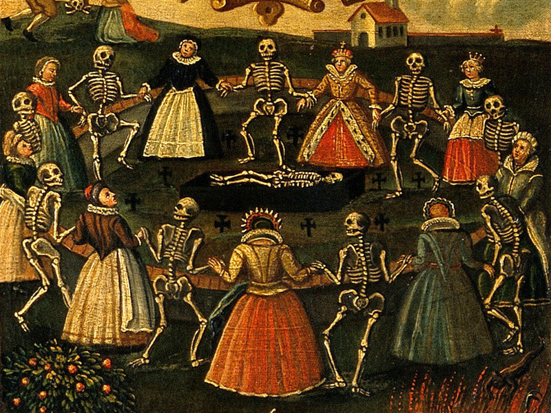
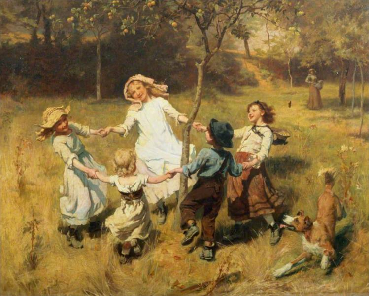
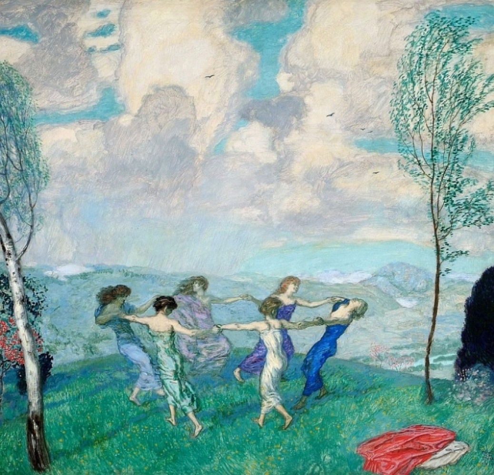
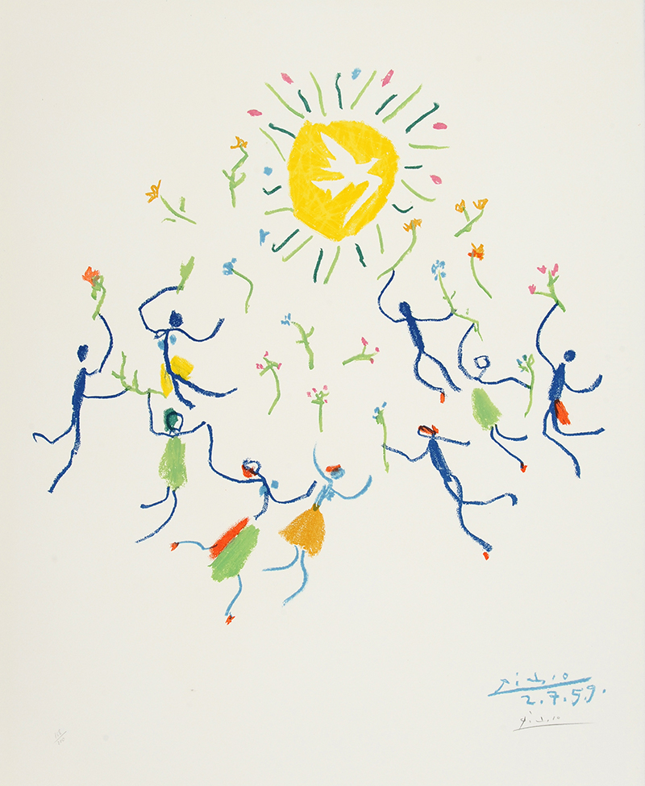
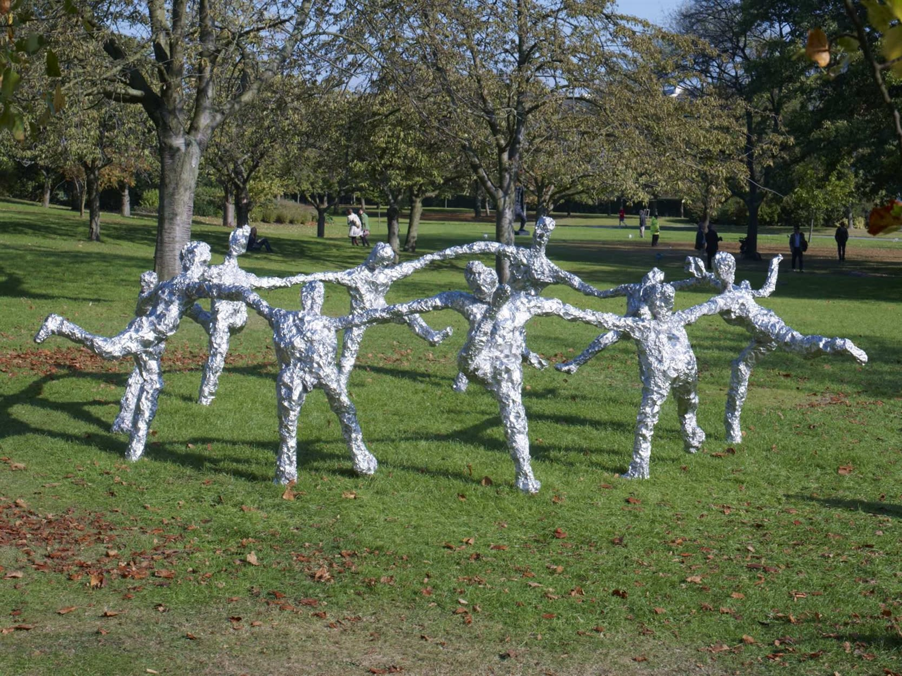

# Cave Painting
  
Dance Scene (Date unknown)

# Bronze age Painting
  
circa approx. 3000BC-300BC

# 1350
  
Panel of Roman de la rose (medieval poem)

# 1514
  
Apollo and the muses - _Baldassare Peruzzi_

# 1700's
  
Dance of death - (Wellcome Library no. 45066i)

# 1885
  
Ring o roses - _Frederick Morgan_

# 1910
  
Circle Dancing - _Franz Von Stuck_

# 1959
  
La ronde de la Jeunesse - _Pablo Picasso_

# 2010
  
Sculptre (RESEARCH NAME) _Tom Friedman_

# 2014
  
Dancers VII - _David Hockney_

# 2020
  
wedding invitiation - _Molly Costello_
