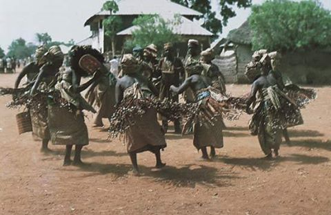
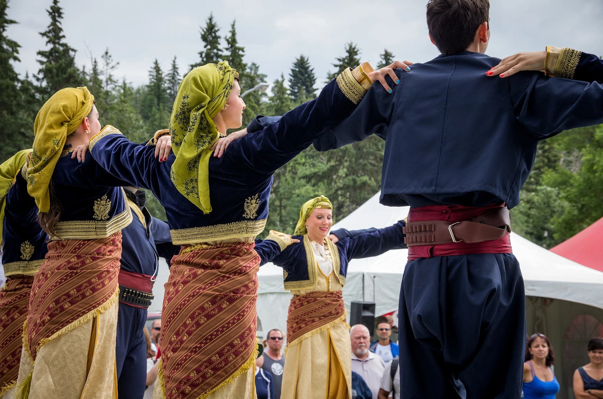
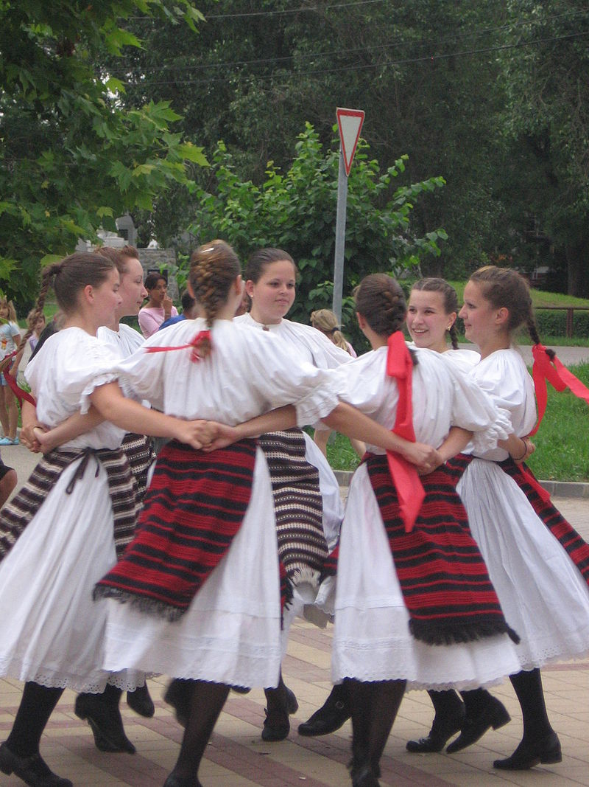
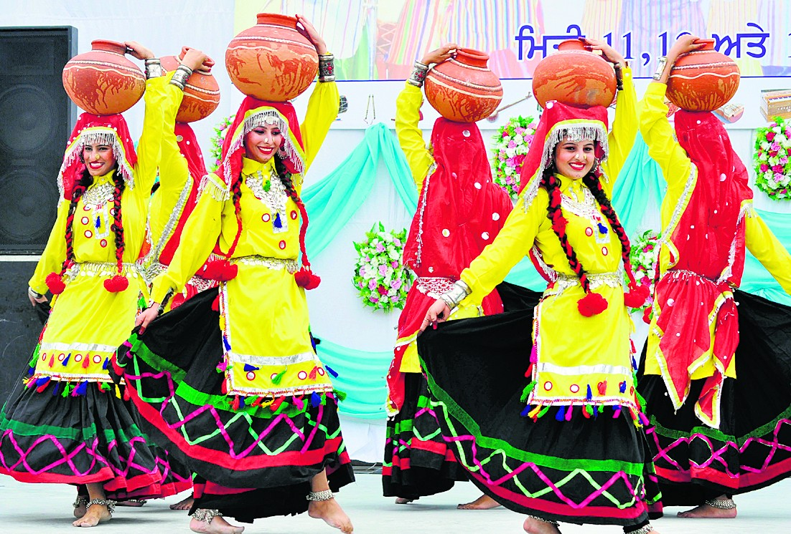
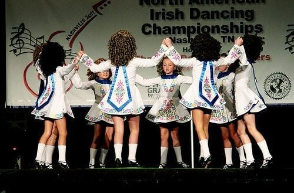
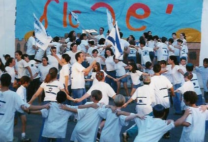
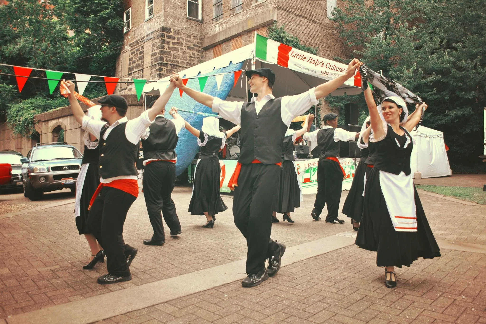
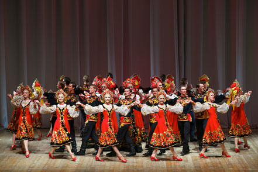
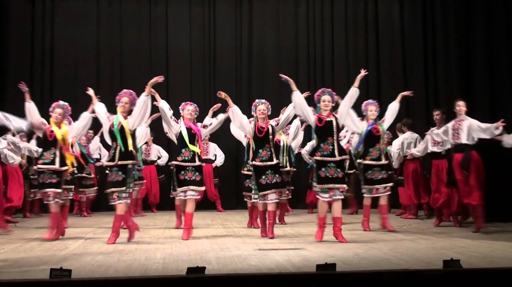

# Africa
  
Jukun women in Nigeria dancing the Ajun-Kpa

# Greece
  
Sirtaki or syrtaki is a dance of Greek origin

# Hungary 
  
Folkdance display in Szegvár during the Ace-festival

# India
  
A Punjabi Folk Dance called Sammi. 

# Ireland
  
The roots of Irish dancing come from the Celts and the druids 

# Israel
  
The Hora is the most well known Israeli circle dance

# Italy
  
The Allegro Dance Company performs in the Italian Heritage Festival.

# Native Americans
  
Native American Crane dance associated with good luck

# Russia
  
The Russian circle dance Horovod has its roots in ancient Slavic traditions 

# United Kindom
  
Nottingham World Circle Dance Group, Nottingham, United Kingdom.

# Ukraine
  
Often referred to as the National Dance of Ukraine, Hopak is a Cossack dance that has its origins in the early 16th century